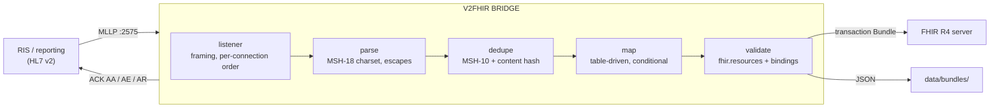

# hl7v2-fhir-bridge

[](https://github.com/seth2177/hl7v2-fhir-bridge/actions/workflows/ci.yml)

**Turn a radiology department's HL7 v2 feed into FHIR R4 without duplicating a patient, losing an order, or un-signing a report.**

Hospitals will run HL7 v2 for decades. New systems, AI platforms included, want FHIR. This is a working reference
implementation of the bridge between them for the radiology workflow. It receives ADT, orders (ORM/OMI) and
results (ORU) over MLLP. Each message becomes one FHIR transaction Bundle of conditional requests, so a resend
changes nothing. Every bundle is validated before it is sent, every resource is traced back to the message that
wrote it, and the sender always gets an ACK it can act on.



## Run it (about a minute)

Requires Python 3.11+.

```bash
git clone https://github.com/seth2177/hl7v2-fhir-bridge && cd hl7v2-fhir-bridge
python -m pip install -r requirements.txt        # Windows: py -3.12 -m pip install -r requirements.txt
python run_demo.py                               # Windows: py -3.12 run_demo.py
```

That one command starts a mock FHIR server and the MLLP listener. A simulated RIS and reporting system then
send one patient's workflow over real TCP: A04 → ORM NW → ORM SC (exam complete) → ORU preliminary → final →
corrected → A08 name change → a second order → its cancel. After that come two things interface engines really
do: resend a message, and send garbage.

```
   #  step                               message   control id  ACK  FHIR  (+ created  ~ updated  = already there; +1 Provenance each)
   1  register outpatient                ADT^A04   RIS00001    AA   +Patient +Practitioner +Encounter
   2  new CT order                       ORM^O01   RIS00002    AA   =Patient =Practitioner =Encounter +ServiceRequest
   3  exam completed (SC/CM)             ORM^O01   RIS00003    AA   =Patient =Practitioner =Encounter ~ServiceRequest
   4  preliminary report                 ORU^R01   RPT00001    AA   =Patient =Practitioner =Encounter =ServiceRequest +ImagingStudy +Practitioner +DiagnosticReport
   5  final report                       ORU^R01   RPT00002    AA   =Patient =Practitioner =Encounter =ServiceRequest =ImagingStudy =Practitioner ~DiagnosticReport
   6  corrected report                   ORU^R01   RPT00003    AA   =Patient =Practitioner =Encounter =ServiceRequest =ImagingStudy =Practitioner ~DiagnosticReport
   7  name change (A08)                  ADT^A08   RIS00004    AA   ~Patient =Practitioner ~Encounter
   8  second order: MR brain             ORM^O01   RIS00005    AA   =Patient =Practitioner =Encounter +ServiceRequest
   9  cancel second order (ORC only)     ORM^O01   RIS00006    AA   ~ServiceRequest
  10  engine resends #2 (same MSH-10)    ORM^O01   RIS00002    AA   duplicate: acknowledged, not sent again
  11  garbage in an MLLP frame           ?         ?           AR   not an HL7 v2 message: must start with MSH, found 'thi'

[3/3] FHIR server state
  Patient           NÚÑEZ-GARCÍA, JOSÉ ANTONIO   MRN SYN100234   version 2
  ServiceRequest    ACC2001  CT CHEST W/O CONTRAST      status completed  version 2
  ServiceRequest    ACC2002  MRI BRAIN W/O CONTRAST     status revoked    version 2
  DiagnosticReport  preliminary -> final -> corrected   (ServiceRequest/4, ImagingStudy/5)
                    conclusion: IMPRESSION: CORRECTED: nodule is in the right LOWER lobe. Follow-up CT
  ImagingStudy      urn:oid:2.25.229850229598152031665758655...  status available
  Encounter 1, Practitioner 2, Provenance 9
```

Eleven messages end up as one patient (renamed, version 2), two orders (one completed, one cancelled) and **one**
report with three versions, linked to its order and its imaging study. The patient appears in every message
but was created once. The resend and the garbage were answered and changed nothing. The demo checks this end
state itself and exits non-zero if it is wrong, and CI runs it on every push.

Other things to try:

```bash
python -m v2fhir convert samples/oru_r01_final.hl7      # one message -> the FHIR transaction Bundle (JSON)
python -m pip install -r requirements-dev.txt && python -m pytest -q
                                                        # parser, escapes, charsets, every mapping, MLLP over TCP,
                                                        # ACK content, idempotency, validation, fuzzing
python -m mock_fhir --port 8080                         # terminal 1: the mock FHIR server
python -m v2fhir serve --fhir-url http://127.0.0.1:8080/fhir   # terminal 2: the listener on :2575
python -m v2fhir send samples/omi_o23_new_stat.hl7      # terminal 3: send a file, print the ACK
```

`python run_demo.py --fhir-url http://localhost:8080/fhir` sends the same traffic to a real server instead, e.g.
`docker run -p 8080:8080 hapiproject/hapi:latest`. The requests follow the R4 spec, but so far only the mock has
executed them (see *Scope and safety*).

## What it handles, and why

| Real-world problem | How the bridge handles it | Where |
|---|---|---|
| Engines resend messages, and a restart forgets what was seen | MSH-10 + content-hash dedupe re-ACKs a resend; every FHIR request is conditional, and orders and reports are checked against the server before writing, so a resend after a restart does not duplicate or roll back anything (the same ORM twice gives one ServiceRequest) | `bridge.py`, `mapping/bundle.py` |
| One control id reused for a different message (counter reset) | processed, with a warning; dropping a real message is worse | `bridge.py` |
| An assigning authority that isn't a namespace, OID, UUID or URI (DNS, local, a mistyped OID), or none at all | still gets its own system; a patient key with no authority at all is AE, never a bare-value search (which in FHIR matches any system) | `mapping/datatypes.py`, `mapping/patient.py` |
| PID-3 repeats with several assigning authorities | the MRN is chosen by configured authority, then type MR; all identifiers kept; the match is on the chosen one | `mapping/patient.py` |
| An old order's PID overwriting a newer A08 | only ADT upserts demographics; orders and results create-if-absent | `mapping/patient.py` |
| ORU arrives before its ORM | the result creates the order; the late NW matches it and cannot re-open it | `mapping/results.py`, `orders.py` |
| Placer, filler and accession numbers arrive in different subsets from different systems | orders and reports match on **any** of them (`identifier=a,b,c`); two different orders matching is AE, not a guess, and so is one stored order whose placer, filler or accession of the same system has a different value (AE 205). An order or report that belongs to another patient (not linked by an A40) is AE too. Numbers are merged, never erased: a message carrying a subset keeps the others | `mapping/orders.py` |
| Cancel for an order the server never saw | ORC-only cancel: AE 204 (unknown key). Full cancel: recorded as revoked, AA with warning | `bridge.py` |
| ORC-only cancel wiping the order | status-only messages become a FHIRPath PATCH of `status`, not a PUT | `mapping/orders.py` |
| An old result overwriting a newer report (a late preliminary after the final, a resent final after the correction, a queued cancel after the final) | reads the current report first; a lower status never replaces a higher one, and at equal status the older OBR-22 loses; the stale entry is dropped with a warning | `bridge.py` |
| A merge erased by the next A08, or a feed that hasn't seen the merge re-activating the old MRN | ADT reads the current Patient first: links are kept and a merged-away record stays retired (warning) | `bridge.py` |
| An old status message re-opening a finished order (a resent SC after the cancel) | reads the current order first; completed and revoked are terminal, so the late status is dropped with a warning | `bridge.py` |
| Timestamps without a time zone | local time in `default_timezone`, DST-correct, with a warning; no zone configured → date only, never a made-up offset | `mapping/datatypes.py` |
| Partial-precision timestamps (`2026`, `202609151430`) | mapped at their real precision (seconds padded only where FHIR requires them) | `mapping/datatypes.py` |
| Non-ASCII names (José Núñez), MSH-18 | declared charsets are decoded strictly: bytes that aren't valid in the declared set, or UTF-8 bytes under a single-byte declaration such as 8859/1, are AE, not a mangled name; undeclared: UTF-8, then cp1252 with a warning | `hl7/charset.py` |
| `\r\n` or `\n` instead of `\r`; a bare LF inside report text | all three terminators accepted; a bare LF in a CR message is data, not a segment | `hl7/parser.py` |
| Empty fields, trailing separators, `""` explicit nulls, padded values | empty ≠ `""`; trailing separators harmless; values stripped | `hl7/parser.py` |
| Escapes and formatted text (`\F\ \S\ \.br\ \H\ \Xhh\`); unescaped `^` in report text | escape handling per v2.5.1 2.7 (formatting commands mapped to line breaks and spaces, with caps); report text read whole, so a stray `^` survives | `hl7/escape.py`, `mapping/results.py` |
| Z-segments (and OMI's IPC) | kept verbatim on the message's Provenance; ZDS-1 becomes the ImagingStudy UID (IHE convention) | `mapping/provenance.py` |
| Malformed message | AR with ERR (location and HL7 0357 code); MSA-2 recovered even when the message does not parse | `hl7/ack.py` |
| Split frames, several messages per read, noise between frames, hang-ups | a streaming frame decoder (linear even on a flood of start blocks); per-connection ordering; idle timeout on reads and ACK writes; a connection limit (`max_connections`) at which the quietest idle connection is dropped. A stalled or silent peer is dropped, never the listener | `mllp.py` |
| Huge message | 2 MB reports pass in linear time; above `max_message_bytes` only 4 KB are kept and an AR carries the right control id | `mllp.py` |
| A training or test feed (MSH-11 T or D) pointed at production | AR 202, never written; `accepted_processing_ids` says which ids this bridge takes | `bridge.py` |
| Unsupported events (A03, SIU…) blocking the sender's queue | AA + warning by default, AR if configured | `bridge.py` |
| Generated FHIR that is subtly wrong | every bundle validated (fhir.resources + required value sets) before it leaves; invalid → AE, never sent | `validate.py` |
| FHIR server down or refusing | down (connection errors, 5xx): retried with backoff, then AR, which v2.5.1 2.9.2.2 defines as "system down, resend later" (`transient_failure_ack = "AE"` for engines that only queue on AE). Refused (4xx): AE, not retried | `bridge.py`, `sink.py` |
| MSH-10 used in a file name | sanitised: `../../etc/passwd` is data | `sink.py` |
| "Which message wrote this?" | `meta.source` on every resource plus one Provenance per message (targets, MSH-10, sender, Z-segments) | `mapping/provenance.py` |

**Every field and code mapping:** [docs/MAPPING.md](docs/MAPPING.md) ·
**One order and its report, hop by hop (with a FHIR primer for v2 people):** [docs/HOW-IT-WORKS.md](docs/HOW-IT-WORKS.md)

## Layout

```
v2fhir/          the bridge
  hl7/           parser, escapes, MSH-18 character sets, ACK builder
  mapping/       v2 -> FHIR: tables.py (every code map), datatypes, patient/encounter, orders, results, provenance
  mllp.py        frame decoder, asyncio listener, client
  bridge.py      parse -> dedupe -> map -> validate -> sink -> ACK; never raises
  validate.py    fhir.resources + required-binding checks
  sink.py        bundle directory and FHIR transaction POST (httpx)
mock_fhir/       in-memory FHIR server that executes transactions (conditional create/update/patch, OR search)
tools/ris_sim.py synthetic RIS and reporting system
samples/         synthetic messages: ADT A04/A08/A40, ORM NW/SC/CA, OMI^O23, ORU (TX and FT), a v2.3 Latin-1 feed
config/          bridge.toml: MRN authority, identifier systems, time zone, limits
tests/           unit, TCP, end to end, fuzzing
run_demo.py      the whole workflow in one command
```

## Quality

- 180 tests run in CI on Linux and Windows, Python 3.11 and 3.12, plus `ruff`. The demo runs too, and checks its
  own end state.
- Every bundle the bridge produces is validated against the FHIR models (`fhir.resources` 8.3, R4B classes) and
  against the required value sets the models don't enforce. The tests validate every sample and every demo
  message.
- Idempotency is tested against a server that really executes the transaction: conditional create, update and
  patch, reference rewriting, all-or-nothing rollback, 404/412.
- Adversarial testing: I fuzzed the parser, mapper and bridge with 120,000 mutated and random messages, and the
  listener with concurrent random bytes, truncated frames and oversize frames. It found real problems:
  control bytes from MSH-3 echoed into the ACK (a `0x1C` there ends the sender's MLLP frame early), a garbage
  segment id echoed into ERR-2 (splitting the ERR segment), and NUL accepted as a field separator. Reviewing
  my own mapping found orders matched on one number when systems send different subsets. Each is fixed, and
  its regression test fails on the old code (`tests/test_adversarial.py`). A seeded fuzz run is part of the
  suite.

## Scope and safety

**Message subset.** ADT^A01/A04/A08/A40, ORM^O01, OMI^O23 and ORU^R01, in HL7 v2.3–2.5.1, for the radiology
workflow. It is not a certified interface engine. There is no general routing, no queueing or persistence of
its own (the sender's queue and the AR/AE resend contract are the durability), no enhanced-mode acknowledgements,
and no batch (FHS/BHS) over MLLP. Text OBX becomes the report; numeric OBX are not mapped to Observations.

**Known limits.** The dedupe cache is in memory. Encounters are matched on the visit number alone, so a site
that reuses visit numbers across facilities needs a per-facility system. The checks that read orders and reports before writing (ordering, number conflicts, patient) and the
unknown-order warning need the FHIR server (the directory sink alone can't know server state). They read
before writing, which is safe for one connection sending in order. Two connections sending updates to the same
report at the same moment can race, and so can concurrent conditional creates on some servers. A40 writes both
patient records rather than calling a server merge operation. The requests are written to the R4 spec and
executed by the mock in the tests; they have not yet been run against HAPI or another production server.

**Security.** The MLLP listener has **no TLS and no authentication**, like most MLLP in hospitals. It binds to
127.0.0.1 by default and belongs on a segmented interface network. To add TLS, pass an `ssl.SSLContext`
to `asyncio.start_server` in `MLLPServer.start()`. For **mTLS**, create it with
`ssl.create_default_context(ssl.Purpose.CLIENT_AUTH)`, `load_cert_chain()` for the bridge's certificate,
`load_verify_locations()` for the CA that issues sender certificates, and `verify_mode = ssl.CERT_REQUIRED`.
Then check the peer certificate's subject against an allow-list of sending applications. Alternatively,
terminate TLS in front of it (stunnel, or the interface engine's own TLS). On the FHIR side it POSTs without
credentials. A real deployment would use SMART Backend Services (OAuth2 client credentials with a signed JWT)
through an `httpx.Auth`. Bundles on disk contain PHI and need the same protection as the FHIR server.

This is a demonstration and reference build, not a medical device. All patients, providers, identifiers,
facilities and UIDs in the repo are synthetic (SYNTH_ prefixes, 555-01xx phone numbers, 2.25 UIDs,
example.org systems). Don't point it at production PHI without a formal review.

---

Built by **Seth Turnbo**: 23 years on MRI/CT (GE, Philips, Siemens), multi-vendor DICOM/HL7/PACS integration, founder of [B&R Global](https://bandrimaging.com). [LinkedIn](https://www.linkedin.com/in/sethturnbo)
